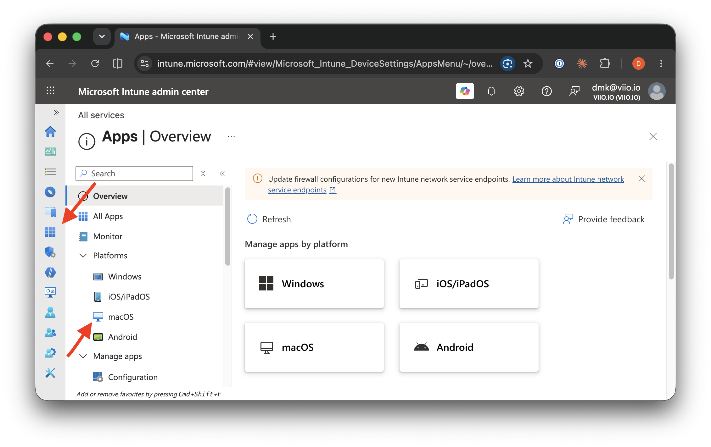
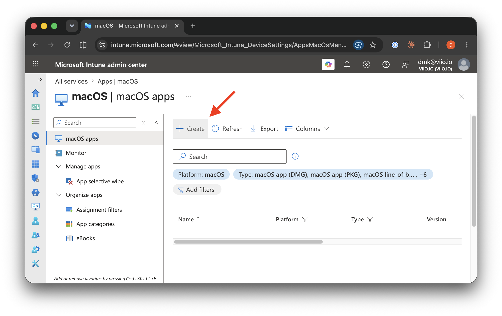
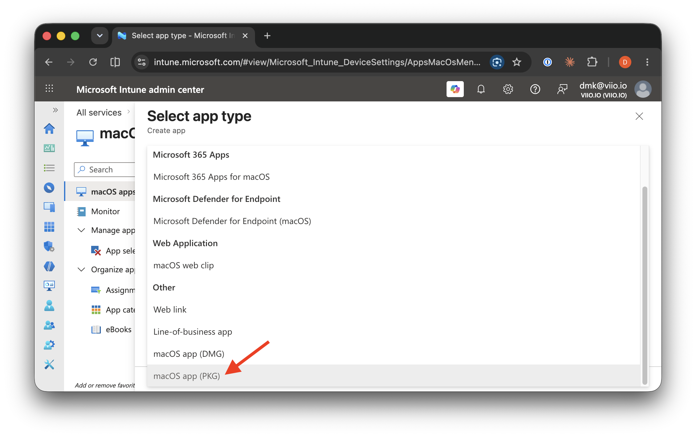
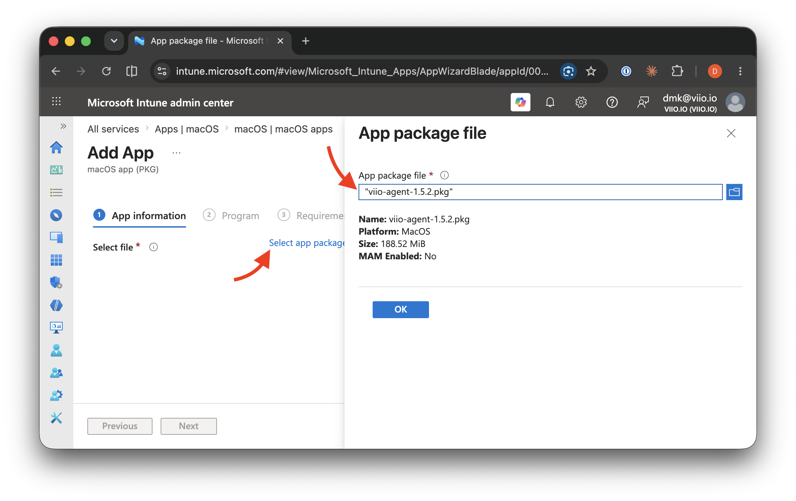
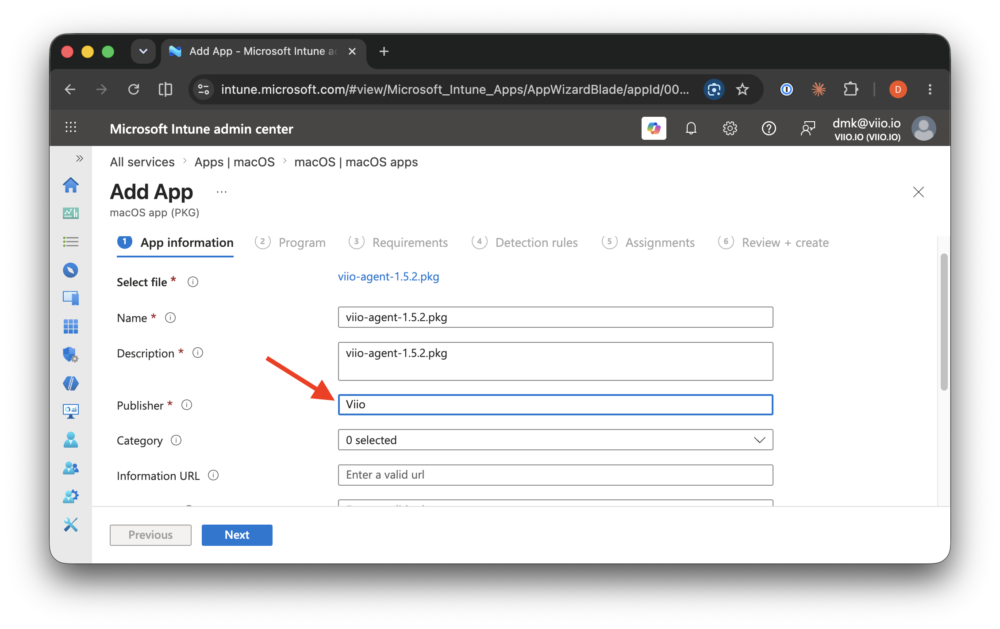
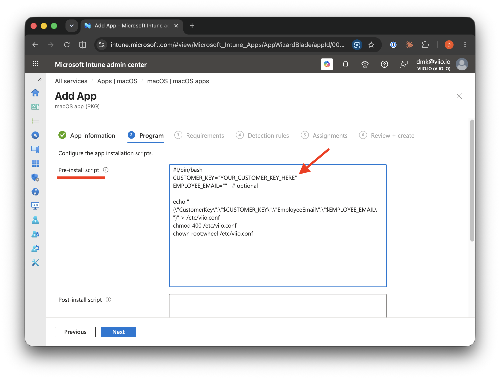
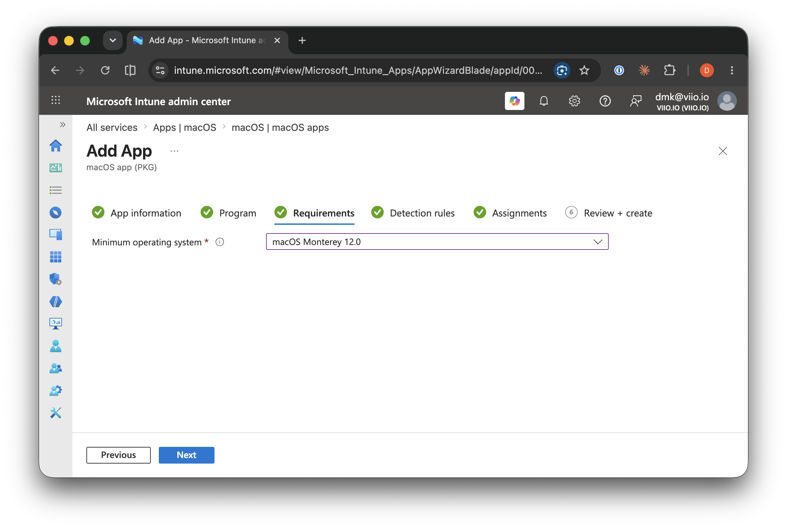
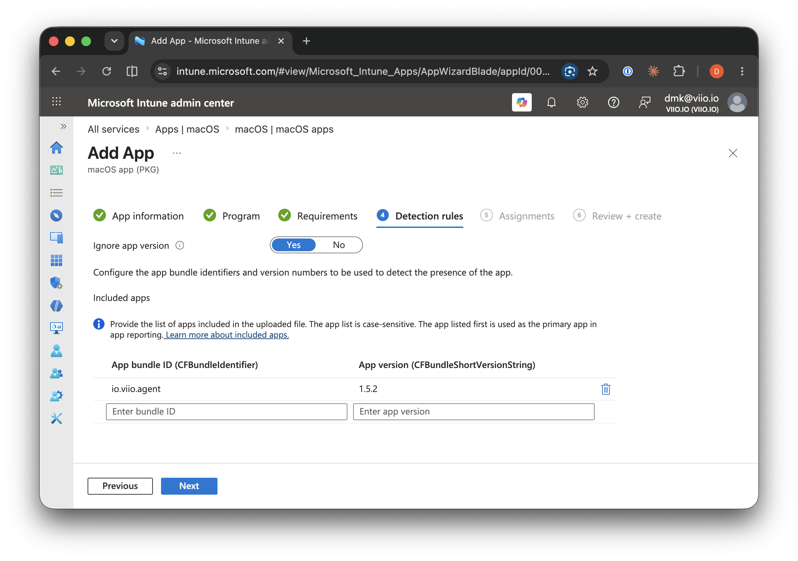
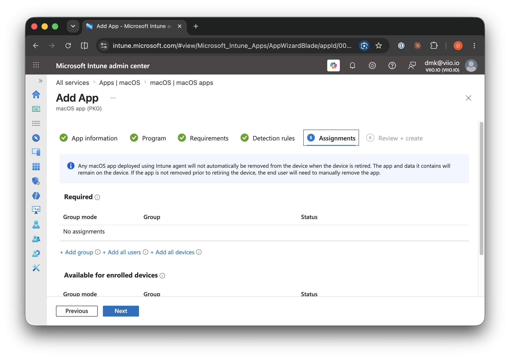
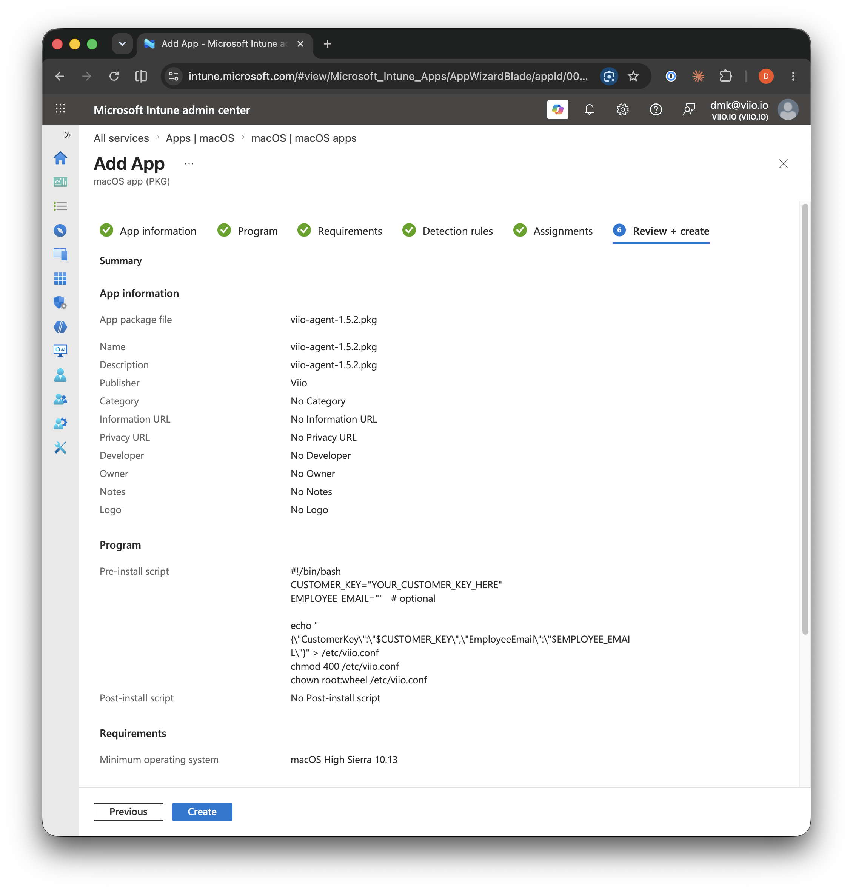

# Deploying the Viio Desktop Agent on macOS via Microsoft Intune

This guide describes how to roll out the Viio Desktop Agent to your macOS fleet
using Microsoft Intune, deploying the agent as a **macOS app (PKG)** with your
Viio customer key supplied through a pre-install script.

## How it works

The Viio agent package itself does not contain your customer key. The agent
reads its configuration from `/etc/viio.conf` on startup. During deployment,
a small pre-install script writes this file before the package is installed,
so the agent is fully configured the moment it starts.

## Prerequisites

- macOS devices enrolled in Intune (MDM).
- Your **Viio customer key**. You can find it in the Viio platform, or request
  it from your Viio contact.

## Step 1 — Download the agent package

Download the agent installer package:

```text
https://cdn.viio.io/desktop-agent/viio-agent-1.5.2.pkg
```

The package is signed by `Oveo ApS (895LF9A7K6)`, Viio's Apple Developer ID.

## Step 2 — Create the app in Intune

In the [Intune admin center](https://intune.microsoft.com), go to
**Apps → macOS**.



On the **macOS apps** page, click **Create**.



In the **Select app type** dialog, choose **macOS app (PKG)** under _Other_.



Upload the `viio-agent-1.5.2.pkg` file you downloaded in Step 1 and click
**OK**.



On the **App information** page, the name and description are pre-filled from
the package. Set **Publisher** to `Viio` and click **Next**.



## Step 3 — Add the pre-install script with your customer key

On the **Program** step, set the following as the **Pre-install script**,
replacing `YOUR_CUSTOMER_KEY_HERE` with your Viio customer key:

```bash
#!/bin/bash
CUSTOMER_KEY="YOUR_CUSTOMER_KEY_HERE"
EMPLOYEE_EMAIL=""

echo "{\"CustomerKey\":\"$CUSTOMER_KEY\",\"EmployeeEmail\":\"$EMPLOYEE_EMAIL\"}" > /etc/viio.conf
chmod 400 /etc/viio.conf
chown root:wheel /etc/viio.conf
```

`EMPLOYEE_EMAIL` is optional and associates a device with a specific employee.
Leave it empty for a fleet-wide rollout; devices can be mapped to employees in
the Viio platform afterwards.



Optionally, add the following **Post-install script** so Intune reports a
failure if the agent did not start after installation:

```bash
#!/bin/bash
sleep 10
launchctl print system/io.viio.agent.metalauncher | grep -q "state = running"
```

## Step 4 — Requirements and detection rules

On the **Requirements** step, set **Minimum operating system** to
**macOS Monterey 12.0** — the oldest macOS version the agent supports.



On the **Detection rules** step, the app bundle ID (`io.viio.agent`) and
version are pre-filled from the package — leave them as they are.



## Step 5 — Assign the app

On the **Assignments** step, add your target device group under **Required**.
The agent installs at the next Intune check-in.



Finally, review the settings on the **Review + create** step and click
**Create**.



## Step 6 — Verify the rollout

- In Intune, open the app and check **Device install status**.
- On a device, you can verify the agent is running with:

  ```sh
  sudo launchctl print system/io.viio.agent.metalauncher | grep state
  ```

  The output should contain `state = running`.

## Troubleshooting

If a device reports a failed installation, run Viio's troubleshooting script
on the device and share the output with [support@viio.io](mailto:support@viio.io):

```sh
bash -c "$(curl -L https://raw.githubusercontent.com/viio-io/agent-installer-scripts/main/macos.troubleshooting.sh)" &> result.txt
```

## Updating the agent

The Intune app pins a specific agent version. When Viio releases a new
package, upload the new `.pkg` to the same Intune app — devices upgrade
automatically at their next check-in.
